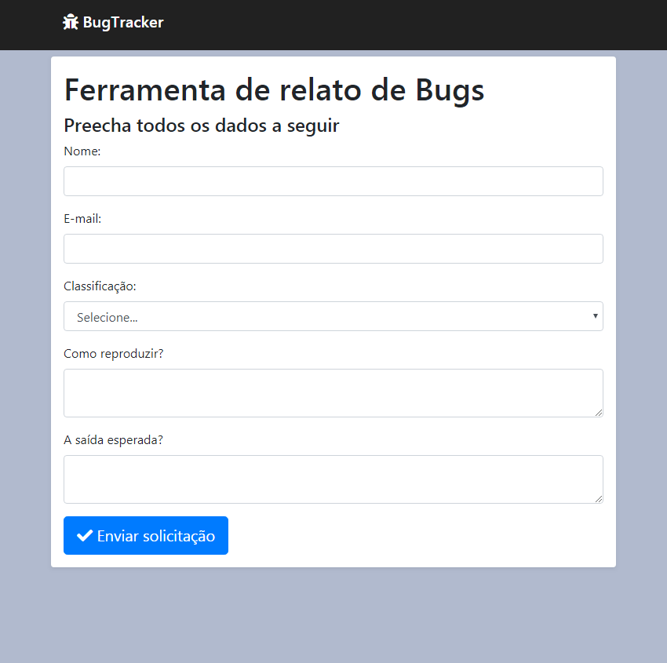

# 

> Notifica Bugs e caso sejam críticos envia um email para o responsável.

[![License MGL-2.0][license-image]][license-url]

Formulário para notificação de bugs, podendo ser colocado respostas esperadas e recebidas.  
Projeto desenvolvido para fixar conhecimentos.



## Ferramentas e tecnologias utilizadas

- Node (v13.1.0)
- express (4.17.1)
- ejs
- Sendgrid
- google-spreadsheet
- serve-favicon

## Fullstack Lab

Este projeto foi feito acompanhando o Fullstack Lab realizado pelo DevPleno em seu canal do [Youtube](https://www.youtube.com/channel/UC07JWf9A0B1scApbS1Te7Ww/).

## Instalação

```bash
yarn install
```

Copie o diretorio config_example para config

```bash
cp config_example config
```

Este projeto utiliza as ferramentas abaixo, sendo necessario criar as credenciais e adiciona-las em config...

- SendGrid
- GoogleSpreadSheet API

## Meta

José Carlos de Lima Junior (Kvasir) – [LinkedIn](https://br.linkedin.com/in/carlosjrlima) – CarlosKvasir@gmail.com

Distribuído sob a licença MPL-2.0. Veja `LICENSE` para mais informações.

[license-image]: https://img.shields.io/github/license/CarlosKvasir/BugTracker?style=flat-square
[license-url]: https://www.mozilla.org/en-US/MPL/2.0/
